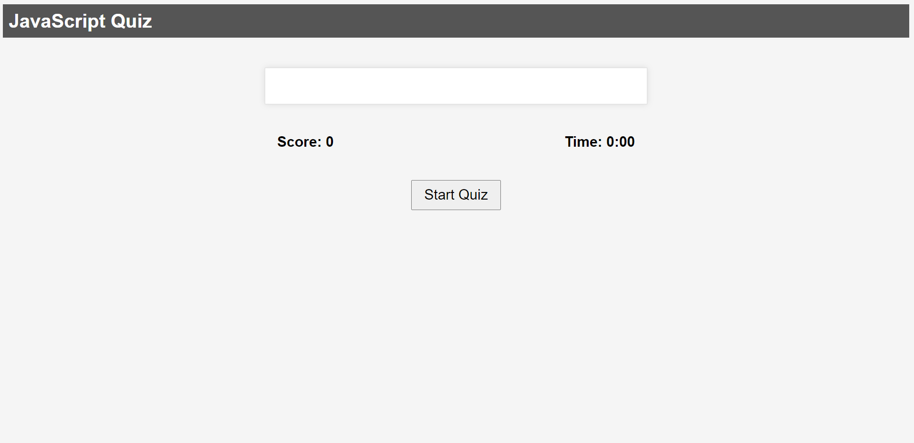
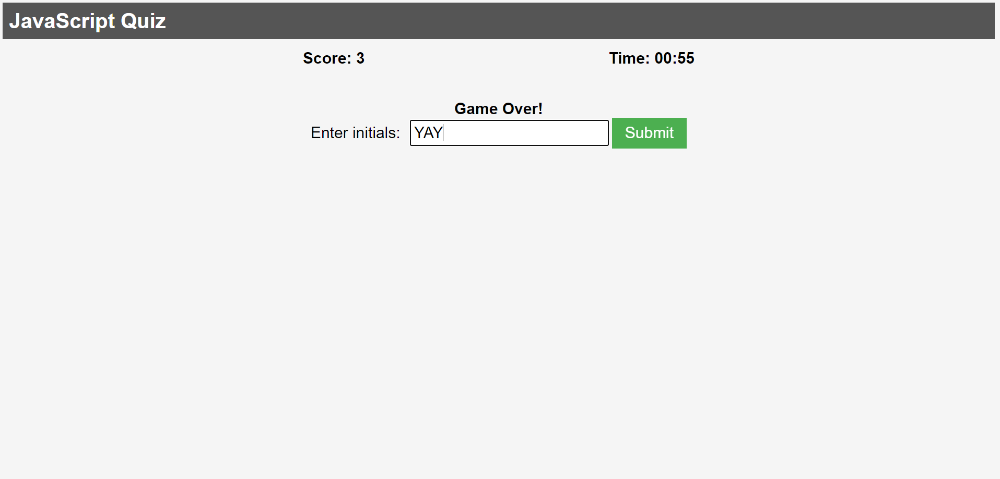
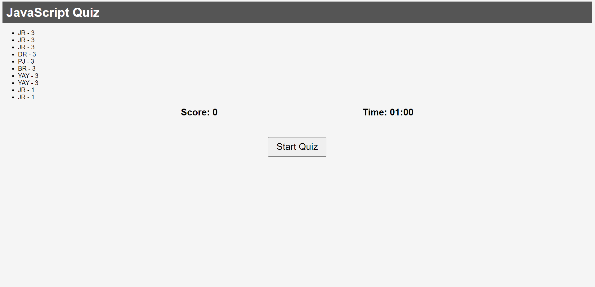

#Module4-Challenge-Quiz

## Description

## User Story
```
AS A coding boot camp student
I WANT to take a timed quiz on JavaScript fundamentals that stores high scores
SO THAT I can gauge my progress compared to my peers
```
## Acceptance Criteria
```
GIVEN I am taking a code quiz
WHEN I click the start button
THEN a timer starts and I am presented with a question
WHEN I answer a question
THEN I am presented with another question
WHEN I answer a question incorrectly
THEN time is subtracted from the clock
WHEN all questions are answered or the timer reaches 0
THEN the game is over
WHEN the game is over
THEN I can save my initials and score
```
## What we did
```
First we created a simple HTML Sheet containing quiz, score, start, end and initial boxes/containers.
Then we created a CSS.style sheet that was intended to be simple yet elegant. 
Finally we created a script.js file for functionality:
We created three unique questions.
Defined our variables.
Created functions to start the quiz, display a question start the timer and end the quiz.
Created functions to input scores, and display high scores.
Added event listeners and prevented default.
```





# 